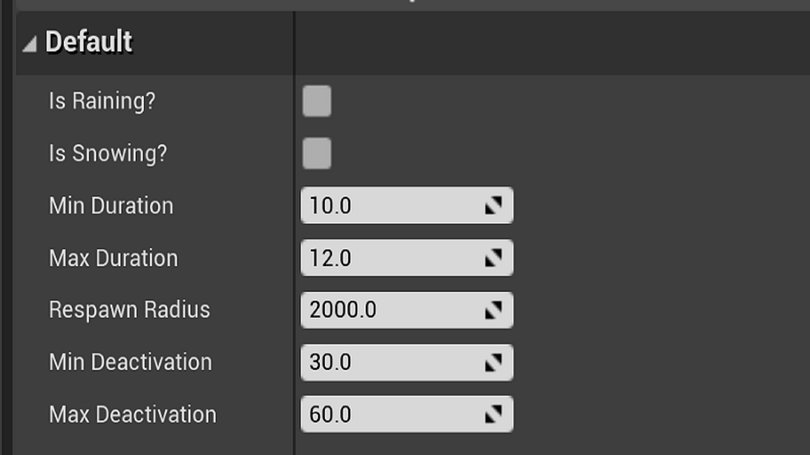
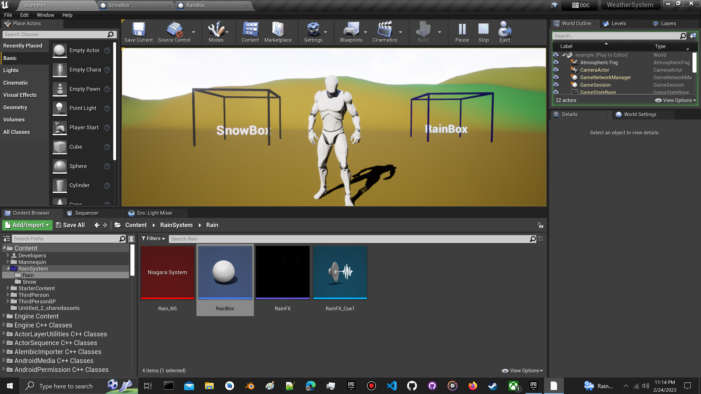
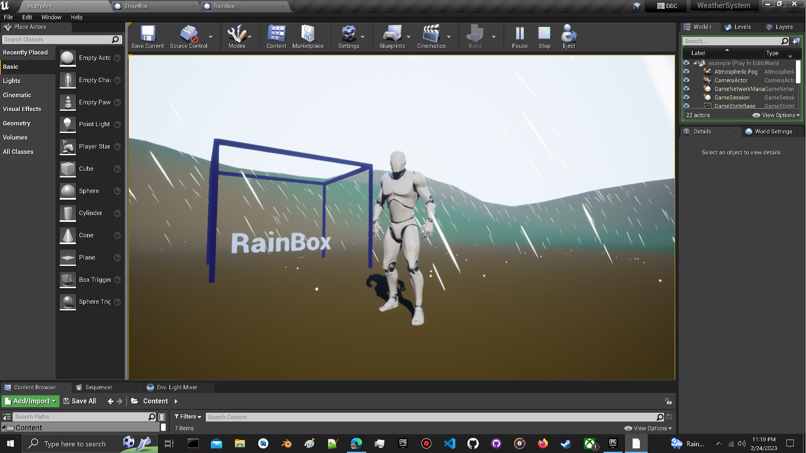
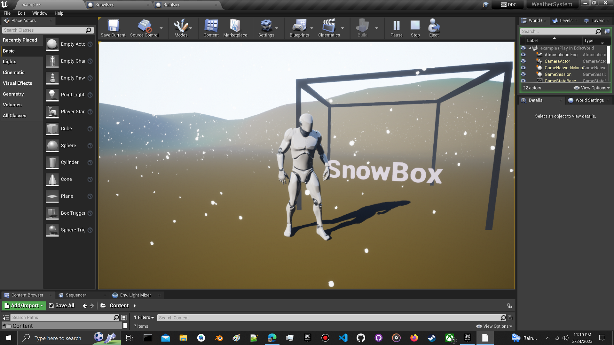
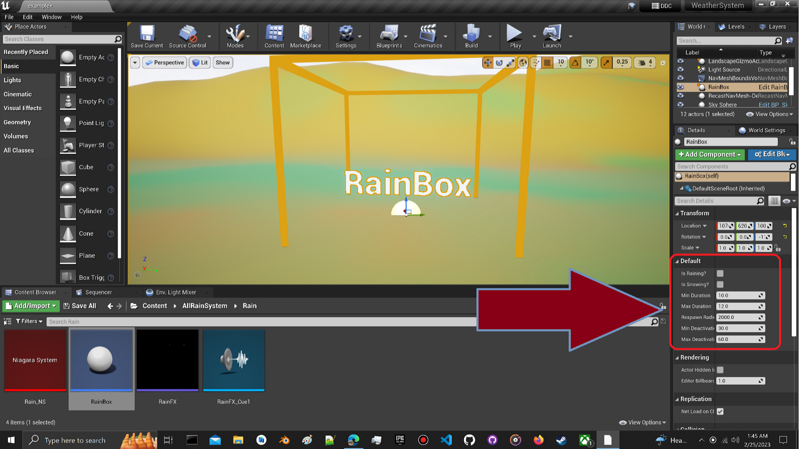

Download from the releases section or go here:
<a href="https://github.com/JRH89/UE-WeatherSystem/releases/download/v1/WeatherSystem.zip">https://github.com/JRH89/UE-WeatherSystem/releases/download/v1/WeatherSystem.zip</a>

<h1>Weather System</h1>

<h2>Drag and Drop!</h2>

Just drag and drop a rainbox or snowbox where you want the weather event to occur.

<u>Features:<u>

<ul>
<li>

Rain

</li>
<li>

Snow

</li>
<li>

Fog

</li>
<li>

SFX

</li>

 

